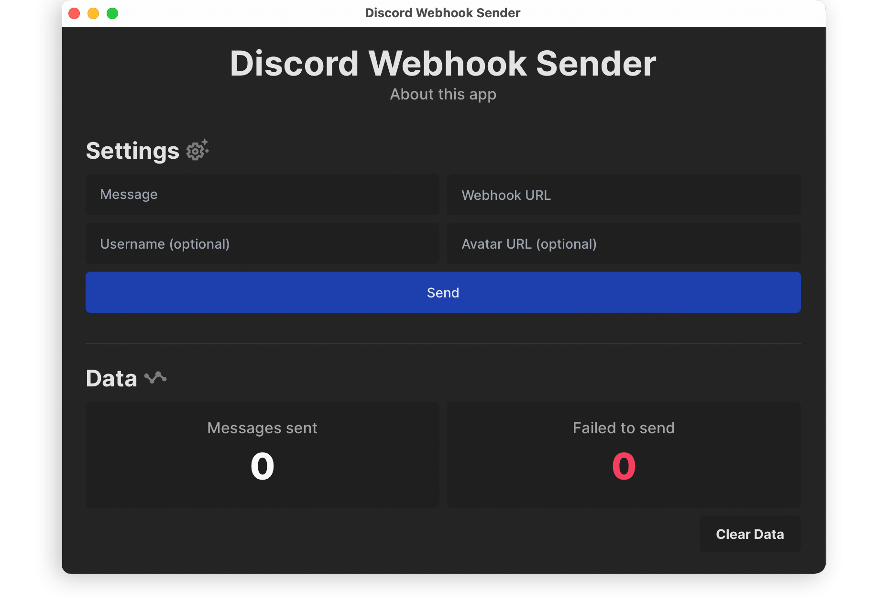

  

<h3 align="center">Discord Webhook Sender</h3>

  Simple Tauri app to send messages using webhooks in Discord.
   
  <a href="https://kadium.kasper.space"><b>Download for Windows, Mac or Linux</b></a>

 

## Dev instructions

### Get started

1. Install Node.js
2. Install Rust
3. Follow the [Tauri setup guide](https://tauri.app/v1/guides/getting-started/prerequisites)
4. Run `npm install` or `yarn`

### Commands

- `npm run dev` / `yarn run dev` : Start app in dev mode.
- `npm run build` / `yarn run build`: Build app

#### Tauri
- `npm tauri dev` / `yarn tauri dev` : Start Tauri app in dev mode.
- `npm tauri build` / `yarn tauri build` : Build Tauri app for production.

### Release new version

1. Update `CHANGELOG.md`
2. Bump the version number in `src-tauri/Cargo.toml`
3. Run `cargo check` to update `Cargo.lock`
4. Create a git tag in the format `v#.#.#`
5. Add release notes to the generated GitHub release and publish it